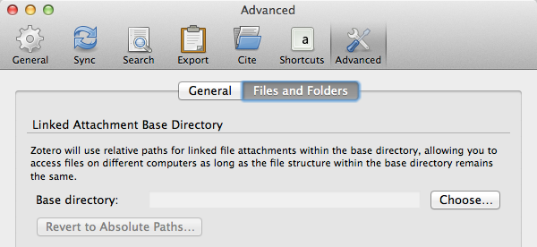
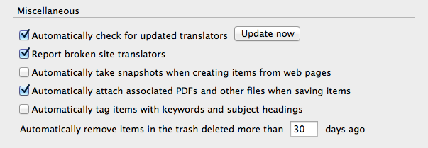

# Chapter Contents
{:.no_toc}

* TOC placeholder
{:toc}

# Storing Files

Zotero can not only help you organize items and notes, but files as well. A popular example is saving journal article PDFs as attachments to their Zotero items, but Zotero can be used to store files of any type.

Files can either be attached to items as child attachments, or added independently.

For information on how to sync your Zotero files, see the Sync chapter. (need to write it)

## File Copies and File Links

When you add files to your Zotero library by hand, you can add them either as copies, or as links.

In case you add a file as a copy, a copy of the selected file is saved in the "storage" subdirectory of the Zotero data directory. These file copies are then synced by Zotero if you have set up file syncing (see the Sync chapter).

In case you add a file as a link, Zotero stores a link to the selected file to remember its location. Linked files are not copied, and are not synced by Zotero.

### File Links with Relative Paths

By default, Zotero uses absolute paths to keep track of linked files. However, in the **Files and Folders** tab of the **Advanced** tab in the Zotero preferences, you can select a base directory for linked files from which Zotero forms relative paths instead. This makes it possible to use a third-party solution (such as Dropbox) to sync (large) files between different computers and operating systems.

For example, you can save some files to a "Zotero Files" directory in your Dropbox folder, and add these files to your Zotero library as links. If you have two computers that are synced through Zotero Sync and through Dropbox, you will be able to access your linked files from within Zotero on either computer, once you have selected the "Zotero Files" directory in the Zotero preferences on both computers.

## Adding Files via Web Translators

When you save items by using a web translator, Zotero will try to download relevant files as well. These can include full-text PDFs of journal articles, and snapshots of webpages. These files are saved as copies, and are added as child attachments of the saved items.

The automatic downloading of files, and of webpage snapshots, can be disabled via the **General** tab of the Zotero preferences, via the "Automatically take snapshots when creating items from web pages" and "Automatically attach associated PDFs and other files when saving items" checkboxes.

## Adding Files via the Zotero Pane

There are several ways to add files in Zotero itself.

###"New Item" Button

You can add files as copies or links via the "New Item" button () at the top of the center column, and selecting either "Link to File…" or "Store Copy of File…". The files will appear as independent files.

###"Add Attachment" Button and Menu

After selecting a single item in the center column, you can add a file as a child attachment of that item. Click either the "Add Attachment" button () at the top of the center column, or right-click the item and go into the **Add Attachment** menu. Then select either "Attached Stored Copy of File…" or "Attach Link to File…".

### Dragging Files

You can also drag a file from your computer (e.g. from your desktop) into Zotero. Dropping the file onto an item will add the file as a child attachment of that item. You can also drop a file onto a collection in the left-hand column, or among the items in the center column. In this case the file will be added as an independent file. Dragged files are added as file copies. Files already in your Zotero library can also be dragged around, e.g. you can drag an independent file onto an item.

## Adding Files from a Webpage

When you're on a webpage with Firefox, **Zotero for Firefox** also allows you to right-click either a link to a file, or an image, and select "Save Link/Image as Zotero Item" in the **Zotero** menu.
