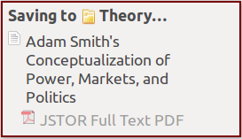
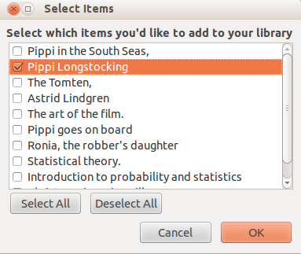
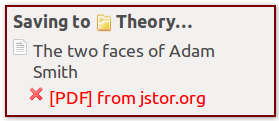
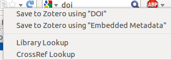
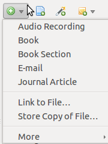
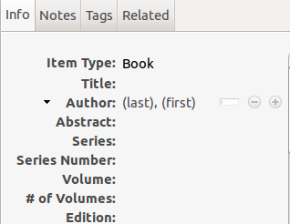
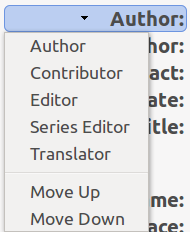
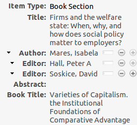
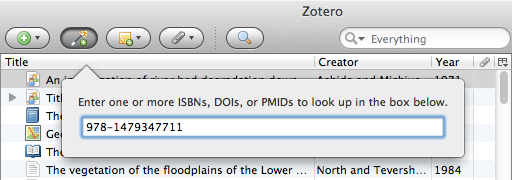
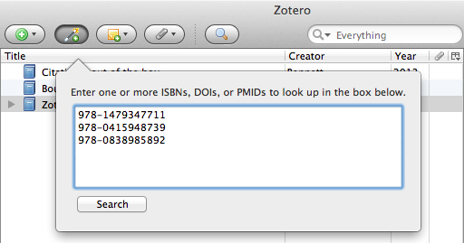

# Chapter Contents
{:.no_toc}

* TOC placeholder
{:toc}

# Adding Items
There are many ways to get items into Zotero. If you become a frequent user, you are likely to use most, if not all of them. The different methods have different advantages and disadvantages and being aware of them will help you. In rough order or priority, you can add items

1. using website translators via the Icon in the URL bar
2. by manually typing them
3. importing them from many bibliographic data formats (RIS, bibtex, MODS, etc.)
4. adding them using an "identifier," i.e. a number like ISBN, DOI, or PMID
5. adding PDF files and then retrieving the "metadata," i.e the citation information, online
6. adding a webpage with basic information from the browser. 

## Using Zotero Web Translators

The principal way to add items into Zotero is from the web-browser, where you do most of your research. Whenever Zotero supports importing directly from a website, you will see a little icon at the right end of the URL bar (in Safari, the icon is to the left of the URL bar). The icon depends on the type of item Zotero identifies on the page. Most common are a lined sheet () for journal articles, a blue book for book () and a manila folder (). 

For single items (i.e. all icons except the manila folder), Zotero will then import the citation information for the item on the page. A gray pop-up 

 

at the bottom right of the screen will let you know that Zotero has successfully imported the item, into which collection (if any) the item is placed, and which attachments are  When you click the folder icon, Zotero will present you with a selection dialog with the title of all items it recognizes on the site&mdash;e.g. the search results of a catalog or the table of contents of a journal. 

 

Select all items you want to import and click OK (or press return) and Zotero will import all selected items, again informing you via the gray pop-up about the items it imports. 

### Automatic Tags and Attachments
For many sites, Zotero takes a snapshot of the current site, or, in the case of newspapers or magazines, often of the single page or print view of an article. For most academic journals and article databases (such as EBSCO or JSTOR), Zotero attempts to download and attach a copy of the full text of an article as a PDF. This will only work where you have access to the full text PDF through your institution&mdash;either by logging in to a proxy while accessing the resource from off-campus or by IP recognition on campus or via Virtual Private Network (VPN). *PDF attachment for proxied resources is less reliable for the connectors than for Zotero Standalone.* Where Zotero tries but fails to download an attachment (typically a PDF file), it displays a red X in front the attachment.

 

As far as they are available, Zotero automatically adds any keywords or subject terms on the translated page as tags. 

You can toggle all three of these options&mdash;attaching snapshots, attaching PDFs, and associating tags&mdash;off and on in the **General** tab of the Zotero preferences.

### Generic Translators
While most translators are tied to specific URLs or URL patterns, Zotero has four translators that try to find items on any site. We call these "generic" translators. While they greatly extend the number of sites Zotero works on, they are somewhat less reliable and often data is of lower quality. For that reason, Zotero always prefers a specific to a generic translator. Where it does not find a site-specific translator, it runs through the generic translators in the following order

* **UnAPI** is a [tiny piece of code](http://unapi.info/) in the header of a page, that offers to serve Zotero and other reference managers with bibliographic data. While unfortunately not very common, where it is implemented (such as for the [INSPIRE database](http://inspirehep.net/?ln=en) for high energy physics) it usually provides high quality and reliable data.

* **COinS** stands for "[Context Object in Span](http://ocoins.info/)" a format in which bibliographic data can be embedded in the code of a website. COinS is a common standard for libraries and you will often find library catalogs (e.g. the Hollis Catalog of Harvard University) providing COinS data to Zotero. Another attractive feature of COinS is that it can be easily generated by Zotero. Every bibliography exported by Zotero in HTML format includes the metadata of all items embedded in COinS. COinS was developed in order to identify sources to facilitate OpenURL requests. It generally does fairly well with books - though frequently only the first of multiple authors is imported. Articles and chapters are even more problematic. 

* **DOI** stands for "[Digital Object Identifier](http://www.doi.org/)." Pretty much all recent journal articles and an increasing number of other sources published online have a DOI, which is a unique ID that identifies it online. DOIs are in a somewhat standardized format, all starting with "10.". Whenever Zotero recognizes one or several DOIs on a page, it looks up the bibliographic data for the DOI(s) in a database provided by CrossRef, the principal maintainer of DOIs. Data provided by CrossRef is typically quite accurate, but does not include abstracts or keywords. There is also a fair chance that the DOI translator will fail for one of three reasons: 1. Since the specifications for the construction of a DOI are rather lax, Zotero may mistake a chain of characters starting with 10. for a DOI; 2. The data for the DOI is not yet in the CrossRef database (this is often the case for very recent articles) and 3. The DOI is registered with a different database than CrossRef. Like IP addresses, DOIs are registered with regional organizations. While CrossRef is by far the biggest such organization, some DOIs will be registered with its Asian or European counterparts.

* **Embedded Metadata** Many academic sites embed metadata in the header of websites, mainly to facilitate searching and finding their resources. The three most common formats are [Google/Highwire](http://scholar.google.com/intl/en/scholar/inclusion.html# indexing) tags for inclusion of resources into google scholar, [Dublin Core (DC)](http://dublincore.org/) tags, and [Prism tags](http://www.idealliance.org/specifications/prism/). Zotero will try to ready all of these and piece together the best possible information. The quality of this may very widely. In some cases, especially using google/Highwire data, results are very good, often better than DOI or COinS results and may even include PDF attachments. In other cases, metadata includes little more than the title. 

You can tell which translator Zotero uses on any given site by hovering (without clicking) your mouse cursor over the translator icon. You will see a little black box displaying "Save to Zotero" followed by the name of the translator in parentheses (DOI in this case): 

. 

*Zotero for Firefox only*: Often, several translators are usable on a page - e.g. a DOI as well as embedded metadata, or a dedicated translator as well as DOI. In **Zotero for Firefox**, you can choose which of these translators Zotero uses by right clicking on the translator icon in the URL bar. The default translator is listed at the top, i.e. DOI in this case 

. 

## Manually Adding Items
No one likes inputting references manually, but at times&mdash;e.g. for primary sources from an archive&mdash;you may still have to. Moreover, frequently items imported in Zotero need manual touching up and it is helpful to understand manual data entry for that purpose.

To create a new item, click on the "New Item" button in the Zotero toolbar.

  

A context menu with the last five item types you have selected will appear. Under "More" at the bottom of the context menu you can select any of the item types available for Zotero (with the exception of "Webpage"&mdash;on that see below). Once you have selected the desired item type, an empty item will appear in the right hand panel. You can then click on any field and type in data or copy&paste it, e.g. from another document. 

### Manually Adding and Editing Creators
Zotero uses the term **creators** to refer to all persons or institutions who contributed to the creation of a work, i.e. authors, editors, composers, painters, etc.
Personal creators should be input as Lastname, Firstname. Zotero is by default set to "two field" mode, intended for entering personal authors in Western format. For corporate authors, such as "United Nations" you should switch to "single field" by clicking on the thin white rectangle to the right of the author field. 

For correct output it is important to *neither* input personal authors in single field mode, *nor* use just the last name field of two field mode for corporate authors.  

To add another creator, you can either click on the round plus sign () next to the author field, or press Shift+Return while in the First Name field. You can change the role of a creator, e.g. from an author to an editor, by clicking on the little arrow to the left of the label "Author." 

 

Available creator roles depend on the item type. While the order in which given creator *types* are entered does not affect citations&mdash;e.g. it does not matter whether editors or authors are listed first for a chapter&mdash;the order in which creators of a given type are listed is reflected in citations. You can move a creator up or down in the list using the **Move Up** and **Move Down** options in the same menu.

**Example:** To add a chapter from an edited volume, select the item type "Book Section." Input the chapter author(s) as "Author," the book's editor(s) as "Editor." Use "Title" for the chapter title and "Book Title" for the title of the book. Include all other relevant publication information (Publisher, Place, Date, Edition, etc.).
 
 

In some cases, typically because of faulty data on a webpage, a creator's last name and first name are reversed. You can switch last and first name by right-clicking on a non-active creator.

### Sentence and Title Case
For correct citation output in all styles, Zotero recommends storing titles in "sentence case," i.e. only capitalizing proper nouns and words at the beginning and after periods and colons. By right-clicking on a title, Zotero gives you the option to automatically convert it to pseudo sentence case. 

This conversion is rather crude and does not deal correctly with proper nouns and capitals after punctuation, but it will still save you a lot of time.

On the flipside, several citation styles used with Zotero (including the various *Chicago Manual of Style* variants and *Modern Language Association*) automatically convert titles to "title case," or "headline capitalization," i.e. all words except prepositions and select conjunctions are capitalized (see the *Chicago Manual's* 16th edition [8.157](http://www.chicagomanualofstyle.org/16/ch08/ch08_sec157.html) for details). While required for English titles, this will incorrectly render non-English titles (e.g. *Die Leiden Des Jungen Werther*). To disable automatic title-casing for any individual item, include its language in the **Language** field. Any combination of letter that does not begin with "en" disables automatic title-casing, but when entering languages manually, we recommend using ISO two-letter language-country codes (according to ISO [639-1](http://www.loc.gov/standards/iso639-2/php/code_list.php) and [3166](http://en.wikipedia.org/wiki/ISO_3166-1# Current_codes), such as *es-AR* for Argentine Spanish, *fr-FR* for French French, or *de-CH* for Swiss German. Using standardized language codes may prove useful as Zotero comes to include more language specific features in future versions. 

### Some Other Tips on Manual Data Entry
* You can use the `Tab` key to get to the next field (`Shift+Tab` for the previous field)
* You can input dates in multiple formats. Zotero recognizes 1990-10-3, 10-3-1990, 10/3/1990, October 3, 1990, Oct. 3, 1990 and several other combinations. The letters "y m d" behind the date field  indicate that Zotero recognizes all three components (Year, Month, Day) of the date. Zotero displays them in the order it recognizes the date items, i.e. Oct. 3, 1990 will be followed by "MDY". For dates with only a month and a year Zotero displays "YM," etc. For both the "Date" and the "Date Accessed" field, Zotero also accepts "yesterday," "today," and "tomorrow" as input and converts them automatically to the correct date.
* For several fields, including **creators**, **Book Title/Publication**, **Publisher**, and **Place**, Zotero offers auto-complete options from items in your library when you start typing.

## Importing from Bibliographic Formats
Zotero imports from a long list of bibliographic formats:

* Zotero and Bibliontology RDF
* MARC (MAchine-Readable Cataloging) and MARC XML
* MODS (Metadata Object Description Schema)
* BibTeX
* RIS (Research Information System Format)
* Refer/BibIX
* RefWorks Tagged Format
* Citation Style Language JSON
* ISI Web of Knowledge
* NCBI Pubmed XML
* CTX (Context Object XML)
* Firefox Exported Bookmarks
* Unqualified Dublin Core RDF

Most of these import translators serve a dual purpose - they allow you to import from a given format, e.g. when transferring data from another reference manager, but they can also be "called" by web import translators. For example, most web translators importing from library catalogs access and import a catalog's MARC data. Since you will only encounter the latter functionality if you want to write your own Zotero translators, we focus on the former here.

There are two ways to import from bibliographic formats. Both can be found under the **Gears Icon** () in the Zotero Toolbar. To import an entire file in a bibliographic format, e.g. as exported from a reference manager, click on 
"Import...," 

 

then select the file you want to import. Zotero will import the contents into a new collection with the timestamp of the import   (import from Zotero RDF and Bibliontology RDF can create collections with different names). 

*The "Import" function only works for bibliographic formats, not for documents, e.g. in PDF format. This is a frequent misunderstanding among first-time users. To add any file to Zotero simply drag it from the file system or use the "Store Copy of File" option under the "Add Item" menu*

### Importing from other Reference Managers
Zotero tries to import and store files attached to bibliographic records. Here are some suggestions for which format to use with which reference manager

* Endnote: Use the "Reference Manager (RIS) Export" format. If you do not have that option available as an output style or if you want to update it, you can do some from Endnote's 
[output style download page](http://endnote.com/downloads/styles?title_op=allwords&title=RIS+Export). If you want file attachments from Endnote to import into Zotero, make sure Endnote's output style contains the line ``L1  - `File Attachments` `` and if not add it to the output style. Export your library and *save the .ris file in Endnote's data directory* which should be the default. Zotero uses the location of the file to infer the location of Endnote attachments. Follow the general import instructions above. Zotero's Dokuwiki contains [detailed instructions](http://www.zotero.org/support/kb/importing_records_from_endnote) on migration from Endnote.

* Mendeley: On Linux and Mac, using Mendeley's BibTeX export generally produces the best results. On Windows, due to issues in handling filepaths in bibtex in both Zotero and Mendeley, using RIS export/import is more reliable.

* RefWork: Zotero supports RefWork's "Tagged" format, use that for export/import. Since RefWorks does not allow exporting file attachments, there is no way to import them into Zotero. 

* "Old" software (e.g. Reference Manager, Procite): Use RIS export/import. You may find solutions to specific issues on the Zotero forum

* "New" software (e.g. Quiqqa, Sente, Paper2): Use BibTex export/import.

### Importing from the Clipboard
Alternatively, you can select one or several entries in a bibliographic format and copying them from to the clipboard (using "copy" from the edit menu or Ctrl/Cmd+C). Then, select "Import from Clipboard" from the Gears menu (see image above). When importing from clipboard, items will be added to the currently selected collection in Zotero. This may be useful to import only parts of a file, or if you see bibliographic data displayed on a website. It is crucial to copy entire records only, otherwise import will fail.

 

### Direct RIS/Refer/BibTeX Import

*Zotero for Firefox only* 

Many online databases offer users the option to export citation data directly to RIS or Refer format (sometimes this option will be called "Export to Reference Manager" or "Export to Endnote"). In most such cases, Zotero will offer import via the URL bar icon as described above and users should always prefer that option. If that option is not available, however, Zotero will, by default, automatically import downloaded citation data in RIS, Refer, and BibTeX format. The first time a user downloads citation data from a page, she will be prompted by Zotero and can opt to always import such data automatically. 

This option, called "Use Zotero for downloaded RIS/Refer files" can be automatically disabled (and re-enabled) in the **General** tab of the Zotero preferences.  

## Adding Items by Identifier

You can quickly add items to your Zotero library using the **Add Item(s) by Identifier** button () at the top of the center column. Zotero can automatically create items from DOIs (for journal articles, via [CrossRef](http://www.crossref.org/)), ISBNs (for books, via the [Library of Congress](http://www.loc.gov/index.html) and [WorldCat](http://www.worldcat.org)), and PubMed IDs (for journal articles, via [NCBI PubMed](http://www.ncbi.nlm.nih.gov/pubmed/)).

There are two ways to add multiple items at once. You can enter multiple identifiers on a single line, separated by a comma or comma-space (e.g., "978-1479347711, 978-0415948739, 978-0838985892"). Alternatively, you can press `Shift + Enter` when the cursor is in the text field to expand the field. You can then copy and paste a list of identifiers into the field (one per line), and press `Shift + Enter` again or click the "Search" button. You can also directly paste a multi-line list of identifiers in the unexpanded text field. It is not possible to add mixed lists of identifiers, i.e. you cannot add a list containing some ISBNs and some DOIs.

## Retrieve Metadata for PDFs

Zotero is able to retrieve data for many PDF files. For any "top-level" PDF, i.e. for any PDF that is *not* attached to a Zotero item, Zotero can attempt to "Retrieve Metadata," in other words, find the bibliographic data online.

### Getting Ready to Retrieve Metadata
There are three ways to get PDFs into Zotero as top-level items:

1. Drag one or several files from your file system. It is possible to simply drag any file to Zotero, both to attach it, but also, as for the retrieve metadata function, at the top level. Drag the file to the middle panel. If a collection is selected, it will be placed into that collection.

2. "Store Copy of File" under the green plus sign has the exact same function as drag&drop

3. **Zotero for Firefox** *only* With the PDF open in Firefox using a PDF plugin (like Adobe's Acrobat plugin or mozilla's own pdf.js) click the **Create Web Page from Current Page** icon () and the PDF will stored in Zotero as a top-level item. As above, it will be placed in the selected collection. You can also save a PDF by right-clicking on the link to the PDF in a webpage and selecting "Zotero --> Save Link as Zotero Item."

### Retrieving Metadata
Next, right-click on the PDF and select "Retrieve Metadata for PDF" from the context menu  

If you are doing this for the first time, Zotero will prompt you to install "pdf tools" 
&mdash; two small programs that allow Zotero to extract text from PDF files. It will automatically take you to the **Search** tab of the Zotero preferences, where you can install the tools with one click.

### How Retrieve Metadata Works
In trying to retrieve metadata for PDFs, Zotero first reads the text content of the PDF and then runs through three steps:
1. It searches for a DOI in the first 80 lines of text and queries the CrossRef database for metadata
2. It searches for an ISBN in the first 80 lines of text and queries Open WorldCat for metadata
3. It picks out a line from the middle of the document and queries google scholar for the verbatim line (the search contains the line in quotation marks) and retrieves the metadata. It will try this up to three times per document.

These steps are designed to minimize false positives, so that Zotero should only in the rarest of cases (less than one percent of cases) find the wrong metadata for a PDF. It will fail more frequently depending on the types or PDFs used: For more recent journal articles, failure rates should generally be below ten percent, but for older articles or gray literature they can be much higher.

In addition, Google Scholar, aiming to prevent "bots" from scraping its database, will lock you out after a certain amount of rapid, automatic queries (typically around 50). In those cases Zotero will advise you that you have reached your query limit. You can then either move your computer to a different internet connection (IP-address), or wait for about a day to resume retrieving metadata. You will still be able to use Google Scholar regularly by filling out a Captcha.

## Adding a Webpage
When you want to add a webpage with not translator (and hence no Zotero URL bar icon), right click anywhere in the page and select "Zotero --> Create Web Page Item from Current Page"
 

in Firefox and "Save Zotero Snapshot from Current Page" in Chrome and Safari. 

 

In Firefox, you can also use the **Create Web Page from Current Page** icon ().

Adding a webpage like this is always a second best to using a translator and will only import rudimentary data, so you should rarely (if ever) use it where import via a translator/URL bar icon is available. However, it does provide several advantages over manually creating a **Webpage** item type: The URL is automatically and correctly saved, as is the access date, and Zotero includes, by default, a Snapshot of the webpage, archiving it in case it later changes or disappears.
