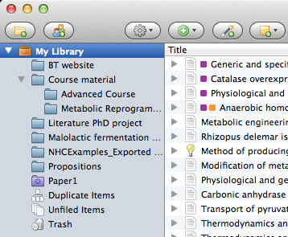
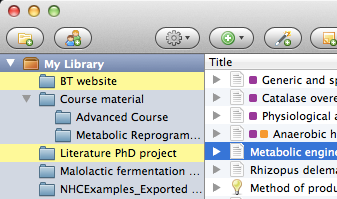

# Chapter Contents
{:.no_toc}

* TOC placeholder
{:toc}

# Collections

Collections help you organize your Zotero library. For instance, you can create a collection for each project you work on. Unlike tags, collections can be hierarchical: each collection can have one or more subcollections. When a collection is selected in the left-hand column, only the items in that collection are shown in the center column. And when you add items to your Zotero library, they are automatically added to the currently selected collection.

Zotero's collections behave a little bit like tags: **My Library** always contains all your items, and each item can be part of any number of collections. Adding an item to a collection does not make a copy of the item. This is different from how folders work on Windows or OS X. Instead, think of playlists in programs like iTunes, where a single song can be part of multiple playlists.

By default, a collection won't show the items that have been added to its subcollections, unless those same items are also part of the parent collection. This can be changed through the hidden preference "recursiveCollections".

(need page on hidden preferences)

## Creating, Renaming, and Deleting Collections

To create a collection, click the **New Collection** button () at the top of the left-hand column. Type the name of the collection and click "OK". Alternatively, right-click **My Library** () in the left-hand column (control-click on OS X) and select "New Collection...". To create a subcollection, right-click an existing collection ( or ), and select "New Subcollection...".

To rename a collection, right-click the collection and select "Rename Collection...". Type the new name and press "OK".

To delete a collection, but keep the items in that collection in your library, right-click the collection and select "Delete Collection...". Confirm by clicking the "Delete Collection" button. To delete a collection and delete all of its items from your entire library, right-click the collection and select "Delete Collection and Items...". Confirm by clicking the "Delete Collection and Items" button.

## Moving and Copying Collections

To move a collection within **My Library**, just drag the collection and drop it onto **My Library**, or onto another collection. To copy a collection within **My Library**, do the same while holding `Ctrl` (`Option` on OS X).

## Adding Items to a Collection

When you create a new item, it is automatically added to the currently selected collection. To add an existing item to a collection, drag the item from the center column and drop it onto the collection in the left-hand column.

It's currently not possible to move items from one collection to another one in a single step. So for now, first add the items to the new collection, and then remove them from the old one.

## Removing Items from a Collection

To remove items from a collection, but keep them in your library, select one or more items in the center column, right-click the selection (control-click on OS X), and select "Remove Item(s) from Collection". You can also select items and press `Delete` (when **My Library** is selected, pressing `Delete` moves the items to the Trash).

## Deleting Items in a Collection

To delete items in a collection, and delete them from your library, select one or more items in the center column, right-click the selection (control-click on OS X), select "Move Item(s) to Trash..." and click "OK". You can also select items and press `Ctrl + Delete` (`Cmd + Delete` on OS X).

## Seeing which Collections an Item belongs to

Select an item in the center column and hold `Ctrl` (`Option` on OS X) to highlight the collections to which the item belongs.

## Special Collections

### Saved Searches

You can save a search in **Advanced Search** by clicking its "Save Search" button and giving the search a name. The saved search ( or ) will then show up as a Saved Search collection. Saved Search collections automatically update as you make changes to your library, always showing the items that match the parameters of the search.

For a detailed description of Saved Searches, see the **Search** chapter.

(need Search chapter)

### Duplicate Items

Sometimes you accidentally end up with multiple items that describe the same resource. Perhaps you just saved an interesting article to your library, forgetting that you already had a copy. While Zotero doesn't do much to prevent you from creating duplicates, it does help you with getting rid of them.

The **Duplicates** collection () contains items that Zotero thinks might be duplicates (e.g. items with the same title, or an identical ID like a DOI). You can select duplicate items in this collection and merge them.

To hide **Duplicates**, right-click the collection (control-click on OS X) and select "Hide". To show the collection once hidden, right-click **My Library** and select "Show Duplicates".

For detailed instructions on merging duplicates, see the **Duplicates** chapter.

(need Duplicates chapter)

### Unfiled Items

The **Unfiled Items** collection () contains all items that do not belong to any (standard) collection.

To hide **Unfiled Items**, right-click the collection (control-click on OS X) and select "Hide". To show the collection once hidden, right-click **My Library** and select "Show Unfiled Items".

### Trash

Deleted items end up in the **Trash** collection ( or ). To empty the **Trash**, right-click the collection (control-click on OS X) and select "Empty Trash".
